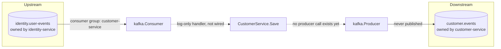
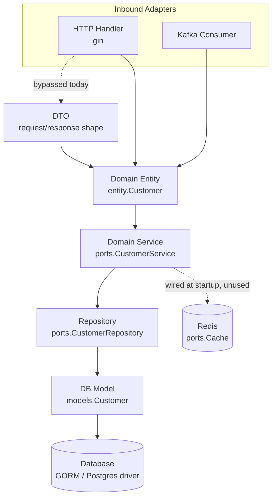

# Customer Service — Architecture & Design

Internal design reference for `customer-service`. Where the root [`docs/architecture-design.md`](../../docs/architecture-design.md) describes the service map for the whole system, this document zooms into the one service: its endpoints, its two async ingress paths, its internal layering, and how to test/observe it. Status notes below reflect the code as it stands today, not the target design — several layers are wired but not yet functional, and that's called out explicitly rather than glossed over.

Per the root doc's §1 service map: customer-service owns **Customer (profile, contact)** only — no vehicle data.

---

## 1. Document Overview

- **Audience**: engineers implementing or reviewing customer-service.
- **Scope**: this repository only (`customer-service/`).
- **Sections**: HTTP endpoints, the Kafka messaging surface, the layered (hexagonal) request path, testing strategy, and monitoring/observability.
- **Related docs**: [root architecture-design.md](../../docs/architecture-design.md) (system-wide service split, event contracts, cross-service data rules), [README.md](../README.md) (local setup, generic scaffolding conventions this repo was templated from).

---

## 2. Endpoints

Registered in [`internal/adapters/http/server.go`](../internal/adapters/http/server.go), mounted under `/api/v1`, routes declared in [`internal/adapters/http/handler/customer-handler.go`](../internal/adapters/http/handler/customer-handler.go).

| Method | Path               | Handler                          | Description              | Status                                               |
| ------ | ------------------ | -------------------------------- | ------------------------ | ---------------------------------------------------- |
| POST   | `/api/v1/accounts` | `CustomerHandler.CreateCustomer` | Create a customer record | Handler + service wired; repository call panics (§4) |

Notes:

- The path is `/accounts` while the resource and every surrounding type is `Customer` — worth reconciling to `/api/v1/customers` unless "account" is a deliberate naming choice elsewhere in the system.
- The handler binds the request body directly to `entity.Customer` (`c.ShouldBindJSON(&acc)`) instead of a request DTO — see §4, the DTO layer is currently an empty file.
- No `GET`/`PATCH`/`DELETE` routes exist yet, so this is create-only today.

---

## 3. Customer (Kafka)

Kafka is the only messaging transport — an earlier SQS-based ingress path has been removed. Producer and consumer sides intentionally point at **different** topics, so this service never replays its own output:

- **Kafka consumer** ([`internal/adapters/kafka/consumer.go`](../internal/adapters/kafka/consumer.go)): consumer group `customer-service` on topic `identity.user-events` (`KAFKA_CONSUMER_TOPIC`/`KAFKA_CONSUMER_GROUP`) — identity-service's user stream. The intent is to react to a new/updated `User` with role=Customer (per the root doc's identity-service/customer-service split) by creating or updating the local `Customer` profile. The handler registered in [`application.go`](../internal/application/application.go) currently just logs the key/value — it doesn't deserialize the event or call the service layer yet.
- **Kafka producer** ([`internal/adapters/kafka/producer.go`](../internal/adapters/kafka/producer.go)): publishes to `customer.events` (`KAFKA_PRODUCER_TOPIC`) for other services (vehicle-service, scheduler-service, notification-service) to consume, but nothing in `CustomerService.Save` calls `Publish` yet — no `CustomerCreated` event is emitted on create.
- Config surface: `KAFKA_BROKERS`, `KAFKA_PRODUCER_TOPIC`, `KAFKA_CONSUMER_TOPIC`, `KAFKA_CONSUMER_GROUP` (see [`config/config.go`](../config/config.go)). `ConsumerTopic` and `ProducerTopic` must never collide — see the comment on the `Kafka` struct.

**To close the gap**, following the root doc's §3 event/outbox convention: define the `UserRegistered`/`Customer*` event contracts, have `CustomerService.Save` write an outbox row in the same transaction as the insert (not a synchronous `Publish` call inside the write path), and point the Kafka consumer handler at the service method instead of leaving it as a logger.

---

## 4. Layered Architecture

Request/message flow follows the hexagonal layering the root README documents (Config → Provider → Repository → Service), with HTTP and messaging as separate inbound adapters converging on the same domain service:

| Layer            | File(s)                                                                                                                                              | Responsibility                                                 | Status                                                                                                                                                                                                                                              |
| ---------------- | ---------------------------------------------------------------------------------------------------------------------------------------------------- | -------------------------------------------------------------- | --------------------------------------------------------------------------------------------------------------------------------------------------------------------------------------------------------------------------------------------------- |
| HTTP             | [`http/server.go`](../internal/adapters/http/server.go), [`http/handler/customer-handler.go`](../internal/adapters/http/handler/customer-handler.go) | gin engine, route registration, request binding                | Functional                                                                                                                                                                                                                                          |
| DTO              | [`http/dto/customer-dto.go`](../internal/adapters/http/dto/customer-dto.go)                                                                          | Request/response shape, decoupled from the domain entity       | **Empty file** — handler binds JSON straight to `entity.Customer`, so the DTO boundary the base README calls for doesn't exist yet                                                                                                                  |
| Entity           | [`domain/entity/customer.go`](../internal/domain/entity/customer.go)                                                                                 | Core domain model: `{ID, Username}`                            | Functional (minimal)                                                                                                                                                                                                                                |
| Service          | [`domain/services/customer-service.go`](../internal/domain/services/customer-service.go)                                                             | Business logic behind `ports.CustomerService`; `Save()`        | `Save` calls `repository.Create` and unconditionally returns `nil` — a create failure can't reach the HTTP layer, and `ports.CustomerRepository.Create` has no error return at all, so the interface itself needs widening before this can be fixed |
| Repository       | [`adapters/repository/customer-repository.go`](../internal/adapters/repository/customer-repository.go)                                               | Implements `ports.CustomerRepository`; entity ⇄ model mapping  | `Create`, `toModels`, `toDomain` all `panic("unimplemented")` — not functional                                                                                                                                                                      |
| DB Model         | [`database/models/account_models.go`](../internal/adapters/database/models/account_models.go)                                                        | GORM struct, maps to table `customer`                          | Functional (minimal)                                                                                                                                                                                                                                |
| DB Provider      | [`database/provider/postgres.go`](../internal/adapters/database/provider/postgres.go)                                                                | Opens the DB connection, pool sizing                           | Named `postgres.go` and exported as `NewMySQLClient`, but opens `gorm.io/driver/mysql` — while `docker-compose.yml` provisions Postgres. Pick one driver and rename to match before wiring the repository up.                                       |
| Cache            | [`adapters/cache/redis.go`](../internal/adapters/cache/redis.go)                                                                                     | Implements `ports.Cache` (get/set/delete with TTL)             | Connected at startup in `application.go` then discarded (`_ = redisCache`) — not used by `CustomerService`                                                                                                                                          |
| Composition root | [`internal/application/application.go`](../internal/application/application.go)                                                                      | Wires config → adapters → service → servers, starts everything | Functional                                                                                                                                                                                                                                          |
| Entrypoint       | [`cmd/server/main.go`](../cmd/server/main.go)                                                                                                        | Process entrypoint                                             | Functional                                                                                                                                                                                                                                          |

---

## 5. Testing

**Current state**: no `*_test.go` files exist anywhere in the module.

Every layer already sits behind a `ports` interface (`CustomerService`, `CustomerRepository`, `Cache`, `Producer`/`KafkaConsumer`), which is exactly the shape that makes each layer mockable in isolation. Suggested layout, in priority order (service and repository first, since those hold the two correctness bugs from §4):

| Layer                   | Approach                                                                                                                                                                                                                     |
| ----------------------- | ---------------------------------------------------------------------------------------------------------------------------------------------------------------------------------------------------------------------------- |
| `domain/services`       | Unit test `CustomerService.Save` against a mock `ports.CustomerRepository`. Blocked on the interface returning an error (§4) — without it there's nothing for the test to assert on failure.                                 |
| `adapters/repository`   | Once `Create`/`toModels`/`toDomain` are implemented: either an integration test against a dockerized instance of whichever database §4 settles on, or a unit test against GORM's sqlmock driver for the mapping logic alone. |
| `adapters/http/handler` | `httptest.NewRecorder` + a gin test context; assert status codes and JSON shape, and once the DTO layer exists, assert its validation errors surface as 400s.                                                                |
| `adapters/kafka`        | Table-driven tests around message (de)serialization once the handler actually parses payloads; `sarama.ConsumerGroup` is already narrow enough to fake with a small interface.                                               |

Run with `go test ./...`; the root README also calls for `golangci-lint run` before merging, though no CI workflow currently invokes either.

---

## 6. Monitoring

**Current state**: [`config/logger.go`](../config/logger.go) is an empty stub (`package config` with no exports) — nothing structured is initialized. Every adapter logs directly through Go's standard `log` package (`log.Printf`/`log.Fatalf` in `application.go`, the Kafka consumer/producer). There is no health-check route in `server.go`, and no metrics or tracing library in `go.mod`.

Recommendations, sized to match what the rest of the service-bay fleet will eventually need (root doc §7 infra mapping):

- **Structured logging**: implement `config/logger.go` (e.g. `log/slog` or `zap`), inject it through `Application` instead of scattering `log.Printf` calls across adapters.
- **Health checks**: add `GET /healthz` (liveness) and `GET /readyz` (checks Postgres/MySQL, Redis, Kafka reachability) to `server.go` — today nothing distinguishes "process is up" from "its dependencies are reachable."
- **Async-path health**: the Kafka ingestion path in §3 currently logs and continues on failure with no alerting. Kafka consumer-group lag is the signal worth alerting on once messages actually flow.
- **Tracing**: once identity-service/API gateway exist per the root doc, propagate a request/trace id from the gateway through the HTTP handler into the service and repository calls, so a customer-create can be followed end-to-end across services.

---

## 7. Known Gaps (summary)

| #   | Gap                                                                                                                     | Where  |
| --- | ----------------------------------------------------------------------------------------------------------------------- | ------ |
| 1   | DTO layer is an empty file; handler binds directly to the domain entity                                                 | §2, §4 |
| 2   | Repository `Create`/`toModels`/`toDomain` all panic — create is non-functional end to end                               | §4     |
| 3   | `CustomerService.Save` swallows repository errors; `ports.CustomerRepository.Create` has no error return                | §4     |
| 4   | DB provider file is named/labeled for Postgres but opens a MySQL driver, while `docker-compose.yml` provisions Postgres | §4     |
| 5   | Redis is connected at startup but never used                                                                            | §4     |
| 6   | The Kafka consumer never calls into `CustomerService` — it's effectively a no-op today                                  | §3     |
| 7   | No event is ever published on customer create                                                                           | §3     |
| 8   | No tests anywhere in the module                                                                                         | §5     |
| 9   | No structured logging, health checks, metrics, or tracing                                                               | §6     |
