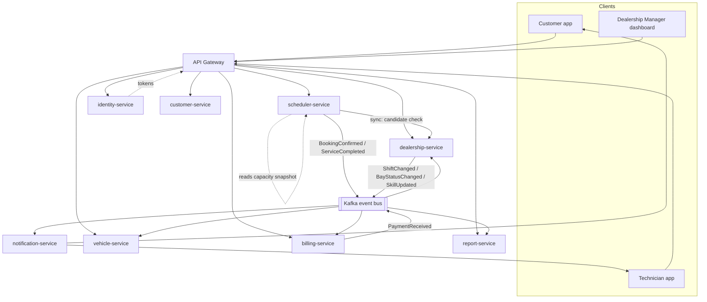

# Architecture Design — Microservices

Target service decomposition for Service Bay, built from `business-requirement.md` §2–3 and the actor/entity list there. Infra assumptions match the existing `docker-compose.yml`: PostgreSQL, Kafka, Redis.

---

## 1. Service Map

| Service | Owns (data) | Responsibility |
|---|---|---|
| **identity-service** | User, Credential, Role | Auth/session for Customer, Technician, Dealership Manager, Admin. Everything else trusts its tokens. |
| **customer-service** | Customer (profile, contact) | Customer account management only. No vehicle data. |
| **vehicle-service** | Vehicle, Warranty | Vehicle registry, ownership link (`customer_id`), warranty status. Builds a per-vehicle service-history read model from scheduler events. |
| **dealership-service** | ServiceHub, ServiceBay, Technician, Skill, TechnicianSkill, Material (inventory), ServiceCatalog (service type, required skill, duration, price) | Everything a hub manages day-to-day: capacity, staffing, stock, catalog. Runs its own consumers for skill progression and inventory decrement (see §5). |
| **scheduler-service** | Booking/Appointment, a local capacity read-model (bay/technician/shift/skill snapshot) | Booking lifecycle: availability search, slot hold/confirm, cancellation, mid-service change requests. The only service that decides whether a slot is taken. |
| **billing-service** | Bill, Payment, Deposit | Bill computation (warranty fee + service fees + material cost) and payment/deposit handling. |
| **notification-service** | Outbox/delivery log | Delivers booking confirmations, mid-service approval prompts, bill-ready notices — email/SMS/push. Consumes the outbox topic, doesn't originate business logic. |
| **report-service** | Daily rollups per hub (read model) | End-of-day aggregation for Dealership Managers: revenue, completed bookings, materials consumed, technician utilization. |

No standalone `worker` or `vehicle+material` service — see §5 and §1a for why those two ideas from the original list are folded in elsewhere.

### 1a. What changed from the original six

- **Vehicle** moved fully into vehicle-service (not split with customer-service's `customer_vehicle`).
- **Material** moved from vehicle-service into dealership-service — it's hub inventory, not a vehicle attribute (business-requirement §8).
- **Billing** and **identity** added — both were implied by §6 and §2 but had no owner.
- **notification-service** added — required for the mid-service approval flow (§5.6) to actually reach the customer.
- **worker** removed as a standalone service. A service that reaches into another service's tables from outside is the coupling you're trying to avoid by splitting in the first place. Its two jobs move to where the data already lives (§5).

---

## 2. Diagram



---

## 3. Communication: sync vs. async

**Synchronous (request/response), kept to a minimum:**

- Gateway → every service, for direct reads/writes initiated by a user action.
- scheduler → dealership-service, at booking time, to fetch candidate `(bay, technician)` pairs. This is the one cross-service call in the hot path — see §4 for why it's bounded and safe to get slightly wrong.

**Asynchronous (Kafka), for everything that isn't a direct user request waiting on an answer:**

| Event | Producer | Consumers | Purpose |
|---|---|---|---|
| `BookingConfirmed` | scheduler | notification | Send confirmation to customer/technician |
| `ServiceCompleted` | scheduler | dealership, billing, vehicle, report | Trigger skill bump, inventory decrement, bill generation, history update, daily rollup |
| `MaterialsConsumed` | dealership | billing, report | Line items for the bill; inventory-usage stats |
| `MidServiceApprovalRequested` | scheduler | notification | Push a real-time prompt to the customer (§5.6) |
| `PaymentReceived` | billing | scheduler, notification, report | Unblock `HELD` → `CONFIRMED` if a deposit gates confirmation; receipt to customer |
| `ShiftChanged` / `BayStatusChanged` / `TechnicianSkillUpdated` | dealership | scheduler | Keep scheduler's local capacity snapshot current |
| `WarrantyChanged` | vehicle | billing | Correct fee calculation on the next bill |

Every service also writes an **outbox row** in the same transaction as its state change, with a relay process publishing it to Kafka — never call notification-service (or Kafka) synchronously from inside a write transaction.

---

## 4. Booking correctness across service boundaries

Splitting the domain doesn't have to weaken the double-booking guarantee, because the fields that matter for that guarantee — bay id, technician id, vehicle id, time range — all live on the Appointment row itself, inside scheduler-service's own database. A uniqueness/overlap constraint scoped to that one table, in that one database, still prevents two bookings from claiming the same bay, technician, or vehicle at the same time, with no cross-service coordination needed for that part.

What *does* cross a boundary is validating that the candidate is legitimate before the write — technician has the right skill, is on shift, the bay is active. That data is owned by dealership-service. Two ways to handle it, and the right one depends on how much staleness you can tolerate:

1. **Synchronous candidate lookup** (in §2's diagram) — scheduler calls dealership-service for candidates at booking time. Simple, always current, but couples scheduler's availability to dealership-service's uptime and latency.
2. **Local capacity snapshot** — scheduler keeps its own read-only copy of shift/skill/bay-status, kept current via the `ShiftChanged`/`BayStatusChanged`/`TechnicianSkillUpdated` events in §3. Booking reads are fully local and fast; the cost is a small eventual-consistency window (a shift change takes one event round-trip to propagate).

Recommendation: start with (1) for simplicity; move to (2) once booking latency or dealership-service load makes the synchronous call a problem. Either way, treat the candidate check as advisory — the final overlap constraint on the Appointment table is what actually prevents a double booking, same as it does today in a single-service design. A candidate that turns out to be invalid (tech went off shift a second ago) is a rare, recoverable case (manual reassignment, same as a sick-day cancellation), not a correctness failure.

---

## 5. Relationships across split databases

Once each service has its own schema, there's no database-level foreign key across service boundaries — Postgres can't enforce `scheduler_db.appointment.vehicle_id → vehicle_db.vehicle.id` even if both schemas sit in the same instance. That integrity check has to move somewhere else. Three patterns cover every cross-service relationship in this system; which one applies depends on how the data is used, not on habit.

### a) Reference by id, validated at write time, never re-validated after

Use for: `Appointment.vehicle_id`, `.customer_id`, `.bay_id`, `.technician_id`, `.service_type_id`.

- Store the id as a plain column, no FK constraint. The *owning* service mints it — use UUIDs, not auto-increment integers, so an id is unambiguous wherever it travels between services.
- Validate it exists at the point where a FK would normally catch a typo: either the caller already validated it upstream (the customer picked a vehicle from a list vehicle-service returned, so it's known-good), or scheduler makes a direct existence check before insert.
- Once written, treat it as historical fact — don't re-validate on every read. An Appointment shouldn't become "invalid" because the vehicle was later deleted; that's what a soft-delete/deactivated state on the owning side is for.

```sql
-- scheduler_db — its own database, no cross-schema FKs
create table appointment (
  id              uuid primary key,
  vehicle_id      uuid not null,   -- owned by vehicle-service
  customer_id     uuid not null,   -- owned by customer-service
  bay_id          uuid not null,   -- owned by dealership-service
  technician_id   uuid not null,   -- owned by dealership-service
  service_type_id uuid not null,   -- owned by dealership-service
  time_range      tstzrange not null,
  status          text not null,
  idempotency_key uuid not null
);
-- overlap/uniqueness constraints on bay_id, technician_id, vehicle_id + time_range
-- are scoped to this table alone — they don't need any other service's schema.
```

### b) Denormalized read-model, kept fresh by events

Use for: scheduler's local capacity snapshot of bay/technician/shift/skill (§4, option 2).

- The owning service (dealership-service) stays the source of truth. The consuming service (scheduler) keeps a local copy purely to avoid a synchronous call on every availability check.
- Never write to it from anywhere but its own event consumer, and never treat it as authoritative for anything outside scheduler's own read path.
- Carry a `version`/`updated_at` on the copy so staleness is at least visible when debugging a stale-slot complaint.

### c) Copy the value at the moment it mattered

Use for: `Bill.warranty_fee`, `Bill.service_fee`, `Bill.material_cost`.

- These are derived from vehicle-service (warranty status) and dealership-service (price, materials consumed) at the moment a bill is generated. Don't store just `vehicle_id` on the Bill and re-resolve warranty status on every future read — copy the *resolved value* onto the Bill row when it's created.
- This is what keeps a historical bill stable: if the vehicle's warranty changes next month, last month's bill doesn't silently change with it.

### What not to do

Because schema-per-service can live in the same Postgres instance, it's technically possible to add a real cross-schema foreign key — Postgres won't stop you. Don't. It silently reintroduces the coupling the split was meant to remove: you lose the ability to move that schema to its own instance later, migrate one service's table without locking another's, or let one service's database be down without failing another service's transaction. If a relationship keeps feeling like it needs a hard FK, that's usually a sign the two entities belong in the same service, not a reason to defeat the boundary.

---

## 6. Background jobs (replacing the standalone `worker`)

| Job | Lives in | Trigger |
|---|---|---|
| Technician skill progression (+0.1 per 10 uses, §7) | dealership-service | Consumes `ServiceCompleted` |
| Material stock decrement (§8) | dealership-service | Consumes `ServiceCompleted` / `MaterialsConsumed` |
| Bill generation (§6) | billing-service | Consumes `ServiceCompleted` |
| Vehicle service-history update | vehicle-service | Consumes `ServiceCompleted` |
| Held-slot expiry sweep | scheduler-service | Internal scheduled job over its own DB |
| End-of-day report rollup | report-service | Scheduled job, reads its own accumulated event log |
| Outbox → Kafka relay | every service that writes an outbox | Internal poller per service |

Each job runs inside the service that owns the data it touches. If you later want one place to *observe* all of this (retries, dead-letter queues, cron health), that's an operational dashboard over these consumers — not a service with write access to six other services' tables.

---

## 7. Infra mapping

- **PostgreSQL**: one schema (or database) per service (`customer_db`, `vehicle_db`, `dealership_db`, `scheduler_db`, `billing_db`, ...), same instance is fine at this scale; split instances only if one service's load actually demands it. scheduler_db is the one that benefits most from Postgres specifically — range types and exclusion constraints make the overlap-safety guarantee in §4 a one-line schema feature instead of application code.
- **Kafka**: the event bus in §3. Topics named per event, one consumer group per subscribing service.
- **Redis**: availability-cache for scheduler's `GET /availability` responses (short TTL — it's a hint, not a source of truth) and/or session cache for identity-service.
- **API Gateway**: single entry point, terminates auth (validates identity-service tokens), routes to services. Also the natural place for per-actor BFF concerns (e.g., assembling a customer's cross-vehicle history from vehicle-service + scheduler-service in one response) so individual services don't need to know about each other's read shapes.

---

## 8. Still open (from business-requirement.md §10)

These affect service responsibilities directly and are worth resolving before finalizing internal APIs:

- **#1 Technician assignment** — automatic-only vs. hub-overridable decides whether "assign technician" logic is entirely scheduler's, or scheduler proposes and dealership-service (hub staff) can override.
- **#3 Mid-service approval** — whether the customer must be reached in real time changes notification-service from "fire and forget" to needing a synchronous-ish wait state on the booking (e.g., a `PENDING_APPROVAL` status with a timeout).
- **#5 Deposit** — fixed/percentage/full affects whether billing-service or scheduler-service decides the `HELD` → `CONFIRMED` gate.
- **#9 Report content/audience** — determines report-service's event subscriptions and whether Dealership Manager is the only consumer or if it needs an export/API for others.
