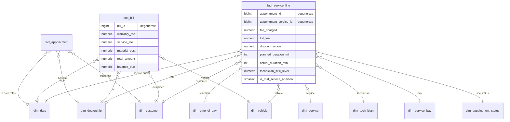
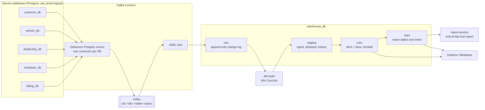

# Data Warehouse Design — Kimball

This document designs the analytics data warehouse for Service Bay with the **Kimball dimensional method**. It maps the business in `business-requirement.md` to business processes, star schemas, and a load pipeline built on the services' own databases.

It is a **design and plan**. Nothing in it is built yet (see §11 for the order of work).

Related documents:

- `business-requirement.md` — the business processes this warehouse measures (§4–§9)
- `architecture-design.md` — service map, event contracts, data ownership rules (§1, §3, §5)
- `technical-requirement.md` — scale targets and the 1k / 100k / 1M load-test tiers (§2)
- `postgres/init/02`–`08` — the OLTP schemas that are the warehouse's sources

---

## 1. Why a warehouse, and what it is not

Each service owns its own database (`architecture-design.md` §5). This is good for the services, but bad for questions that cross them. For example: *"What was the revenue per hub last month, split by service type, and how much of it came from services added mid-service?"* needs data from scheduler, dealership, billing and vehicle at the same time. No single service can answer it, and no service is allowed to read another service's tables.

The warehouse is the **one place where cross-service joins are allowed**. It is:

- **Read-only for the business.** Nothing writes back from the warehouse into a service.
- **A copy, not a source of truth.** If the warehouse and a service disagree, the service is right, and the warehouse load has a bug.
- **Historical.** It keeps the past state of things (a technician's level last year, a material's price before it changed). The services only keep the current state.

It is **not** a replacement for the services' own read paths. A customer's booking list still comes from scheduler-service. The warehouse serves managers, reports, and analysis, with data that is minutes to hours old.

---

## 2. The Kimball method, applied

Kimball designs a warehouse in four steps for each business process:

1. **Select the business process** — an event the business does and wants to measure (a booking, a payment), not a department or a table.
2. **Declare the grain** — what exactly one row of the fact table means. This is the most important decision. Every other choice must match the grain.
3. **Identify the dimensions** — the "who, what, where, when, how" that describe each fact row.
4. **Identify the facts** — the numbers measured at that grain (amounts, counts, durations).

Dimensions that several processes share (date, hub, customer, vehicle, service, technician, material) are built **once** and reused. Kimball calls them **conformed dimensions**. They are what let you "drill across" two fact tables in one report — for example, compare service revenue (from billing) with technician hours (from scheduling) for the same hub and month.

The **bus matrix** in §4 is the plan: business processes are the rows, conformed dimensions are the columns.

---

## 3. Business processes

Taken from `business-requirement.md` §4–§9 and the OLTP schemas:

| # | Business process | Business requirement | Source (service → table) | Key business question |
|---|---|---|---|---|
| P1 | **Appointment lifecycle** (book → check in → service → complete / cancel / no-show) | §4, §5 | scheduler → `appointment`, `appointment_vehicle` | How many bookings, how many complete, how long between steps, how many no-shows? |
| P2 | **Service performed** (one service line on one vehicle) | §5, §5.6 | scheduler → `appointment_service` | Which services sell, at which hub, by which technician, how long do they take, how many were added mid-service? |
| P3 | **Material consumption** | §5, §8 | dealership → `inventory_transaction` (`OUT`, with `appointment_id`) | Which materials are used, cost vs. price, margin per hub |
| P4 | **Inventory movement and stock level** | §8 | dealership → `inventory_transaction`, `inventory_stock` | Stock on hand per hub, restock frequency, stock-outs |
| P5 | **Billing** | §6 | billing → `bill` | Revenue split into warranty fee / service fee / material cost |
| P6 | **Payment** (deposit and final) | §6 | billing → `payment` | Deposit usage, payment methods, failed / refunded payments, time to pay |
| P7 | **Capacity utilization** (bays and technicians) | §5, §9 | scheduler → `appointment_bay`, `appointment_technician`; dealership → `service_bay`, `technician`, `dealership` hours | How busy is each bay and technician per day? |
| P8 | **Technician skill progression** | §7 | dealership → `technician_skill` | How fast do technicians level up, and does level affect speed or rework? |
| P9 | **Vehicle ownership** | §3 | vehicle → `customer_vehicle` | New vehicles registered, ownership transfers |
| P10 | **Customer accounts** | §2 | customer → `customer`; identity → user events | New customers, active / inactive / banned over time |

P1, P2, P3, P5 and P7 are the **first phase**. They answer the end-of-day hub report (§9 of the business requirement) and most manager questions. P4, P6, P8–P10 come after.

---

## 4. Bus matrix

✔ = the dimension is on that fact table. Date roles are listed in §6.1.

| Business process → fact table | Date | Time of day | Dealership (hub) | Customer | Vehicle | Service | Technician | Material | Service bay | Storehouse | Skill | Payment profile | Appt. status |
|---|---|---|---|---|---|---|---|---|---|---|---|---|---|
| P1 `fact_appointment` | ✔ (5 roles) | ✔ | ✔ | ✔ | | | | | | | | | ✔ |
| P2 `fact_service_line` | ✔ | ✔ | ✔ | ✔ | ✔ | ✔ | ✔ | | ✔ | | | | ✔ |
| P3 `fact_material_usage` | ✔ | | ✔ | ✔ | ✔ | ✔ \* | | ✔ | | ✔ | | | |
| P4 `fact_inventory_movement` | ✔ | | ✔ | | | | | ✔ | | ✔ | | | |
| P4 `fact_inventory_daily_snapshot` | ✔ | | ✔ | | | | | ✔ | | ✔ | | | |
| P5 `fact_bill` | ✔ | | ✔ | ✔ | ✔ | | | | | | | | |
| P6 `fact_payment` | ✔ | ✔ | ✔ | ✔ | | | | | | | | ✔ | |
| P7 `fact_bay_daily_utilization` | ✔ | | ✔ | | | | | | ✔ | | | | |
| P7 `fact_technician_daily_utilization` | ✔ | | ✔ | | | | ✔ | | | | | | |
| P8 `fact_skill_level_change` | ✔ | | ✔ | | | | ✔ | | | | ✔ | | |
| P9 `fact_vehicle_ownership_event` | ✔ | | | ✔ | ✔ | | | | | | | | |
| P10 `fact_customer_status_event` | ✔ | | | ✔ | | | | | | | | | |

\* Only after the source records which service line used the material — see gap G4 in §10.

---

## 5. Fact tables

Kimball has three main kinds of fact table. This design uses all three:

- **Transaction fact** — one row per event, never updated (a payment, a service line).
- **Periodic snapshot** — one row per thing per period, even when nothing happened (stock per material per day).
- **Accumulating snapshot** — one row per "process instance" with a column for each milestone. The row is **updated** as the process moves forward (an appointment going from booked to completed).

All money columns are `numeric(14,2)` in one currency (see §10, G8). All fact tables use **surrogate keys** to the dimensions (`*_key`), never the service ids. The service id stays on the fact only as a **degenerate dimension** (for example `appointment_id`) so you can trace a row back to the source.

### 5.1 `fact_appointment` — accumulating snapshot (P1)

**Grain:** one row per appointment.

| Column | Type | Notes |
|---|---|---|
| `appointment_id` | degenerate | From `scheduler_db.appointment.id` |
| `dealership_key`, `customer_key` | FK | Customer at booking time |
| `appointment_status_key` | FK | Current status (junk dimension, §6.10) |
| `booked_date_key` | FK → `dim_date` | `appointment.created_at` in hub local time |
| `scheduled_date_key`, `scheduled_time_key` | FK | `scheduled_start` |
| `checked_in_date_key` | FK | When status became `CHECKED_IN` (−1 = not yet) |
| `completed_date_key` | FK | When status became `COMPLETED` (−1 = not yet) |
| `cancelled_date_key` | FK | When status became `CANCELLED` or `NO_SHOW` |
| `vehicle_count`, `service_line_count` | int | |
| `planned_duration_min` | int | `scheduled_end − scheduled_start` |
| `actual_duration_min` | int | First service start → last service finish |
| `lead_time_days` | int | Booking → scheduled date |
| `checkin_delay_min` | int | Scheduled start → check-in (negative = early) |
| `total_amount` | money | `appointment.total_amount` |
| `is_completed`, `is_cancelled`, `is_no_show` | 0/1 | For easy `SUM()` |

The milestone timestamps are not columns in `appointment` today. They come from the **status change history** that CDC captures (§8). This is one reason the design uses CDC.

### 5.2 `fact_service_line` — transaction (P2)

**Grain:** one row per service performed on one vehicle in one appointment (`scheduler_db.appointment_service`). This is the **most detailed** grain for service work, and most manager reports start here.

| Column | Type | Notes |
|---|---|---|
| `appointment_id`, `appointment_service_id` | degenerate | |
| `service_date_key`, `start_time_key` | FK | `started_at`, or `scheduled_start` if not started |
| `dealership_key`, `customer_key`, `vehicle_key` | FK | |
| `service_key` | FK | SCD2 version valid at service time |
| `technician_key` | FK | `do_by`, SCD2 version valid at service time |
| `service_bay_key` | FK | Through `appointment_bay_id` |
| `appointment_status_key` | FK | Line status (`DONE`, `CANCELLED`, …) |
| `fee_charged` | money | Price actually charged (copied at the time, `architecture-design.md` §5c) |
| `list_fee` | money | `service.fee` at that time, from `dim_service` |
| `discount_amount` | money | `list_fee − fee_charged` |
| `planned_duration_min` | int | `service.duration_minutes` |
| `actual_duration_min` | int | `finished_at − started_at` |
| `technician_skill_level` | numeric | Technician's level in the required skill **at service time** |
| `is_mid_service_addition` | 0/1 | Added during the work (business §5.6) — needs gap G1 |
| `is_warranty_expired` | 0/1 | From the bill: `warranty_fee > 0` |
| `line_count` | 1 | Always 1, for `SUM()` |

### 5.3 `fact_material_usage` — transaction (P3)

**Grain:** one row per material consumed for one appointment (an `OUT` row in `dealership_db.inventory_transaction` with an `appointment_id`).

| Column | Notes |
|---|---|
| `inventory_transaction_id`, `appointment_id` | degenerate |
| `usage_date_key`, `dealership_key`, `storehouse_key`, `material_key`, `customer_key`, `vehicle_key` | FK |
| `service_key` | −1 (unknown) until gap G4 is fixed |
| `quantity` | `abs(quantity)` |
| `unit_cost` | `material.in_price` at that time (SCD2) |
| `unit_price` | Price charged to the customer (see gap G5) |
| `cost_amount`, `revenue_amount`, `margin_amount` | `quantity × unit_cost`, `quantity × unit_price`, the difference |

### 5.4 `fact_inventory_movement` — transaction (P4)

**Grain:** one row per `inventory_transaction` (`IN`, `OUT`, `ADJUST`). Signed `quantity` (+ in, − out), `unit_price`, `amount`, `movement_type` (in the `dim_inventory_movement_type` junk dimension), `appointment_id` (degenerate, nullable).

### 5.5 `fact_inventory_daily_snapshot` — periodic snapshot (P4)

**Grain:** one row per material per storehouse per day, **including days with no movement**.

Facts: `quantity_on_hand` (semi-additive: add across materials and hubs, **never** across days — use the last day or the average), `stock_value_at_cost`, `quantity_in_today`, `quantity_out_today`, `is_out_of_stock`.

Built from `inventory_stock` at the end of each hub's day. This table grows the fastest (§9), so at the 1M tier keep daily rows for 90 days and monthly rows after that.

### 5.6 `fact_bill` — transaction (P5)

**Grain:** one row per bill (`billing_db.bill`).

Facts: `warranty_fee`, `service_fee`, `material_cost`, `total_amount`, `deposit_paid`, `final_paid`, `balance_due`, `refunded_amount`, `days_to_full_payment`.
Dimensions: `bill_date_key`, `fully_paid_date_key`, `dealership_key` (through the appointment), `customer_key`, `vehicle_key`, `bill_status_key`.

`fact_bill` is the **revenue source of truth** in the warehouse. Every revenue number in a report must reconcile to `SUM(fact_bill.total_amount)` (§8.4).

### 5.7 `fact_payment` — transaction (P6)

**Grain:** one row per payment attempt (`billing_db.payment`). Facts: `amount`, `is_succeeded`, `is_refunded`. Dimensions: `payment_date_key`, `payment_time_key`, `payment_profile_key` (type × method × status), `customer_key`, `dealership_key`; `bill_id` and `payment_id` as degenerate dimensions.

### 5.8 `fact_bay_daily_utilization` and `fact_technician_daily_utilization` — periodic snapshots (P7)

**Grain:** one row per bay per day, and one row per technician per day.

| Fact | Bay | Technician |
|---|---|---|
| `available_min` | Hub open → close, if the bay is `AVAILABLE` | Hub open → close, if the technician is `ACTIVE` (proxy — see gap G6) |
| `reserved_min` | Sum of `appointment_bay` slots, not cancelled | Sum of `appointment_technician` slots, not cancelled |
| `worked_min` | Sum of actual service time in the bay | Sum of `appointment_service` actual time with `do_by` = technician |
| `utilization_pct` | `reserved_min / available_min` | same |
| `service_line_count` | | Lines done that day |

These two tables answer the "technician utilization" line of the end-of-day report.

### 5.9 Other facts (later phases)

- `fact_skill_level_change` (P8, transaction) — one row per change of a technician's skill level: `level_before`, `level_after`, `level_delta`, `services_since_last_change`. Built from the CDC history of `technician_skill`.
- `fact_vehicle_ownership_event` (P9, transaction) — one row per `customer_vehicle` row: event type (`ASSIGNED` / `TRANSFERRED`), `owned_days`. Could also be built from the `OwnerAssigned` / `VehicleTransferred` events.
- `fact_customer_status_event` (P10, factless) — one row per customer status change (`ACTIVE`, `INACTIVE`, `BANNED`, deleted).

---

## 6. Dimension tables

Rules for every dimension:

- **Surrogate key** `*_key bigint` (identity), plus the **natural key** from the service (`*_id`).
- **SCD columns** on every Type 2 dimension: `valid_from timestamptz`, `valid_to timestamptz` (`9999-12-31` for the current row), `is_current boolean`, `row_hash` (to detect changes).
- **Special rows:** key `−1` = "Unknown / not applicable", key `−2` = "Late arriving" (the fact came before its dimension row — see §8.3). Facts **never** have a `NULL` foreign key.
- **Flatten hierarchies** into the dimension (Kimball prefers wide, denormalized dimensions). Do not snowflake `vehicle → vehicle_model` or `service → service_type`.

### 6.1 `dim_date` and `dim_time_of_day`

- `dim_date`: one row per day (key `YYYYMMDD`). Day of week, week, month, quarter, year, `is_weekend`, `is_vn_public_holiday`, fiscal period.
- `dim_time_of_day`: one row per minute (1,440 rows). Hour, 15-minute slot, `day_part` (morning / afternoon / evening), `is_business_hours`.
- **Role-playing:** the same `dim_date` is used as booked date, scheduled date, check-in date, completed date, bill date, payment date. In the BI tool, expose each role as its own view (`dim_booked_date`, `dim_completed_date`, …).
- **All dates are the hub's local business date**, not UTC. The end-of-day report is "per hub, per local day". Timestamps stay in UTC in the fact; only the date key uses local time (see gap G7).

### 6.2 `dim_dealership` (hub) — SCD Type 2

Natural key `dealership_id`. Attributes: `name`, `address`, `city`, `region` (derived from address), `lat`, `lng`, `open_hour`, `close_hour`, `open_minutes_per_day`, `active_status`, `bay_count`, `technician_count`.
Type 2 on `name`, `address`, hours, `active_status` (a report for last year must use last year's opening hours). Counts are refreshed daily (Type 1).

### 6.3 `dim_service_bay` — SCD Type 2

Natural key `service_bay_id`. `code`, `status`, plus the hub's name and region (flattened). Type 2 on `status` and `dealership_id`.

### 6.4 `dim_customer` — SCD Type 2 (mixed)

Natural key `customer_id` (and later the identity `user_id`, see gap G9).

| Attribute | SCD type | Notes |
|---|---|---|
| `status` (`ACTIVE` / `INACTIVE` / `BANNED` / `DELETED`) | 2 | `DELETED` comes from `delete_at` |
| `age_band` (from `birthday`) | 1 | Store the band, not the birthday |
| `customer_since_date` | 0 | `created_at` |
| `name`, `email`, `phone` | 1, **masked** | See §8.5 (PII) |
| `email_domain` | 1 | Useful for analysis without the full email |

### 6.5 `dim_vehicle` — SCD Type 2

Natural key `vehicle_id`. Flatten the model: `vin`, `license_plate`, `make`, `model`, `model_year`, `vehicle_age_years`, `warranty_end_date`, `status`.
Type 2 on `warranty_end_date` (needed to explain the warranty fee on old bills) and `status`. Type 1 on `license_plate`.
The current owner is **not** in this dimension. Ownership changes are a separate process (P9), and each fact already has its own `customer_key`.

### 6.6 `dim_service` — SCD Type 2

Natural key `service_id`. `name`, `service_type_name` (flattened), `fee` (list price), `duration_minutes`, `active`, `required_skills` (text list, for display), `primary_skill_name`, `max_required_level`.
Type 2 on `fee`, `duration_minutes`, `active`, `name`. This is how a report shows the list price that was valid at the time of service.

If you need to filter or group by every required skill, add the bridge table `bridge_service_skill (service_key, skill_key, required_level)`.

### 6.7 `dim_technician` — SCD Type 2

Natural key `technician_id`. `name`, `level` (`APPRENTICE` … `MASTER`), `active_status`, `join_date`, `tenure_band`, hub name (flattened).
Type 2 on `level`, `active_status`, `dealership_id` (a technician moving to another hub must not move their old work with them).
Skill levels are **not** stored here. They change too often and there are many per technician. They live in `fact_skill_level_change` and as `technician_skill_level` on `fact_service_line`.

### 6.8 `dim_material` — SCD Type 2

Natural key `material_id`. `sku`, `name`, `type`, `in_price`, `out_price`, `margin_pct`. Type 2 on both prices.

### 6.9 `dim_storehouse` and `dim_skill`

Small Type 1 dimensions. `dim_storehouse`: `name`, `status`, hub name. `dim_skill`: `name`, `max_level`.

### 6.10 Junk dimensions

Small sets of flags and codes, combined into one dimension each so the fact tables stay narrow:

- `dim_appointment_status` — `status`, `status_group` (`OPEN` / `DONE` / `LOST`), `is_final`.
- `dim_payment_profile` — every combination of `type` (`DEPOSIT` / `FINAL`) × `method` × `status`.
- `dim_bill_status` — `PENDING` / `PARTIALLY_PAID` / `PAID` / `VOID`.
- `dim_inventory_movement_type` — `IN` / `OUT` / `ADJUST` × reason.

---

## 7. Star schemas

The main star — service line (P2) — and how it shares dimensions with the bill and appointment facts:



Example DDL for the star's center (warehouse Postgres, schema `core`):

```sql
CREATE TABLE core.fact_service_line (
    appointment_id          bigint      NOT NULL,
    appointment_service_id  bigint      NOT NULL,
    service_date_key        int         NOT NULL REFERENCES core.dim_date(date_key),
    start_time_key          smallint    NOT NULL REFERENCES core.dim_time_of_day(time_key),
    dealership_key          bigint      NOT NULL REFERENCES core.dim_dealership(dealership_key),
    customer_key            bigint      NOT NULL REFERENCES core.dim_customer(customer_key),
    vehicle_key             bigint      NOT NULL REFERENCES core.dim_vehicle(vehicle_key),
    service_key             bigint      NOT NULL REFERENCES core.dim_service(service_key),
    technician_key          bigint      NOT NULL REFERENCES core.dim_technician(technician_key),
    service_bay_key         bigint      NOT NULL REFERENCES core.dim_service_bay(service_bay_key),
    appointment_status_key  smallint    NOT NULL REFERENCES core.dim_appointment_status(appointment_status_key),
    fee_charged             numeric(14,2) NOT NULL,
    list_fee                numeric(14,2) NOT NULL,
    discount_amount         numeric(14,2) NOT NULL,
    planned_duration_min    int,
    actual_duration_min     int,
    technician_skill_level  numeric(4,1),
    is_mid_service_addition smallint    NOT NULL DEFAULT 0,
    is_warranty_expired     smallint    NOT NULL DEFAULT 0,
    line_count              smallint    NOT NULL DEFAULT 1,
    loaded_at               timestamptz NOT NULL DEFAULT now(),
    PRIMARY KEY (appointment_service_id, service_date_key)
) PARTITION BY RANGE (service_date_key);   -- one partition per month

CREATE INDEX ON core.fact_service_line (dealership_key, service_date_key);
CREATE INDEX ON core.fact_service_line (technician_key, service_date_key);
```

Foreign keys inside the warehouse are fine (it is one database owned by one loader). Drop them on the largest facts if loads become slow; the dbt tests in §8.4 check the same thing.

---

## 8. Load architecture (ETL)

### 8.1 Source choice: CDC, with domain events as a second input

There are two ways to get data out of the services:

| | **CDC** (Debezium reads each service's Postgres WAL) | **Domain events** (the outbox topics in `architecture-design.md` §3) |
|---|---|---|
| Coverage | Every table, every column, every change | Only what a service chooses to publish. Today: customer and vehicle only. dealership, scheduler, billing are not built. |
| History for SCD2 and milestones | Yes — every row version with its time | Only if the event carries the full state |
| Initial load | Built in (snapshot mode) | Needs a separate backfill |
| Coupling | To the service's **internal** table structure | To a published **contract** |
| Code changes in services | None | Every service must publish complete events |

**Decision: CDC as the main source.** Reasons: most source services are not built yet, the accumulating snapshot (§5.1) and the SCD2 dimensions need the history of every change, and CDC needs no service code.

To control the coupling problem:

- Only the **staging layer** (§8.2) knows the OLTP column names. If a service renames a column, only one staging model changes.
- Each service's `README` gets a short **"tables read by the warehouse"** list. A migration that changes one of those tables must be reviewed for the warehouse too (same idea as the event contract rule in `architecture-design.md` §3a).
- Where a domain event carries a meaning that tables do not show (for example `ServiceCompleted`), the warehouse may also land that topic and use it.

Do **not** capture `outbox_message` tables — they are delivery plumbing, and their content is already in the business tables.

### 8.2 Layers



| Layer | Schema | Content | Built by | Rule |
|---|---|---|---|---|
| raw | `raw` | One table per source table: every Debezium change (`op`, `before`, `after`, `source.lsn`, `ts_ms`) as received | Kafka Connect JDBC sink | Append-only. Never edited. Can be replayed. |
| staging | `stg` | Typed columns, renamed to warehouse names, duplicates removed (at-least-once delivery), one row per source row **version** | dbt (incremental) | The only layer that knows OLTP column names |
| core | `core` | Conformed dimensions (with SCD) and fact tables from §5–§6 | dbt (incremental + snapshots) | Kimball rules from this document |
| mart | `mart` | Business-ready tables: `mart_daily_hub_report`, `mart_monthly_revenue`, … | dbt | What reports and dashboards read |

**Why Kafka Connect and not a Flink job for loading:** Debezium and the JDBC sink are ready-made connectors that need only configuration. A Flink job would be custom code to maintain for the same result. Flink (already deployed with no jobs) is kept for the **real-time phase** (§11, phase 5): live "today" numbers per hub from the CDC topics.

**Schedule:** dbt runs **hourly** for staging and core, and **once per hub-day close** (after the last hub closes, around 19:00 local time) for the daily snapshots and `mart_daily_hub_report`. Data freshness target: ≤ 1 hour for core, by 20:00 local time for the daily report.

### 8.3 Loading rules

- **Surrogate key lookup by time.** A fact row joins to the dimension version that was valid at the fact's event time (`event_time >= valid_from AND event_time < valid_to`), not to the current row.
- **SCD Type 2** in dbt with `dbt snapshot` (strategy `check` on the Type 2 columns), or a custom incremental model built from the staging history.
- **Late-arriving dimensions.** If a fact arrives before its dimension row (for example an appointment for a customer whose CDC row has not landed yet), insert an **inferred member** in the dimension (natural key only, other attributes "Unknown"), use its key, and fill the attributes when the real row arrives (Type 1 update of the inferred row).
- **Late-arriving facts.** Facts are loaded with a **look-back window** (re-process the last 3 days each run), so a change that arrives late still lands in the right date partition.
- **Accumulating snapshot updates.** `fact_appointment` is upserted on `appointment_id` each run. Milestone dates are only set once (first time the status reached that value).
- **Idempotency.** Every model can run twice with the same result: incremental models use `merge`/`delete+insert` on the natural key, never plain `insert`.
- **Deletes.** CDC delete events (`op = 'd'`) do not delete facts. They mark the dimension row or the fact as `is_deleted`. Soft deletes (`customer.delete_at`) become a Type 2 status change to `DELETED`.

### 8.4 Data quality

- **dbt tests on every model:** `unique` and `not_null` on keys, `relationships` from every fact key to its dimension, `accepted_values` on status codes.
- **Reconciliation checks** (run after each daily load, fail the job and alert if they differ):
  - `SUM(fact_bill.total_amount)` per day = `SUM(bill.total_amount)` in `billing_db` for the same day.
  - Count of `fact_service_line` rows = count of `appointment_service` rows.
  - `fact_inventory_daily_snapshot.quantity_on_hand` = `inventory_stock.quantity` for the snapshot day.
- **Freshness checks:** `dbt source freshness` on each raw table (warn after 1 h, error after 3 h).
- **Alerts in Prometheus** (same stack as the services): Debezium connector status, Kafka Connect consumer lag, and — most important — **replication slot lag on each service database**. A stopped connector keeps its slot, and Postgres keeps all WAL for it, which can fill the OLTP disk. Alert when `pg_replication_slots` retained WAL > 5 GB.

### 8.5 Security and PII

- The warehouse connects to the services with a **read-only replication user** per database, limited to the published tables.
- `dim_customer.name`, `email`, `phone` are stored **masked** in `core` (for example `j***@example.com`). The real values sit in a restricted `pii` schema that only a few roles can read. Most analysis needs only `customer_key`, `age_band`, and `email_domain`.
- `raw` and `stg` contain real PII, so they have the same restricted access as `pii`.

---

## 9. Volume and sizing per tier

This uses the same tiers as the load tests (`technical-requirement.md` §2, `loadtest/`, `k8s/overlays/`). Assumptions, to be replaced with real numbers later:

- One appointment per registered user per year (some customers come twice, many not at all).
- 2.5 service lines per appointment, 3 material rows per service line.
- Hubs: 2 / 20 / 200. Each hub has 8 bays, 15 technicians, 500 stocked SKUs.

| Rows per year | 1k users | 100k users | 1M users |
|---|---|---|---|
| `fact_appointment` | 1k | 100k | 1M |
| `fact_service_line` | 2.5k | 250k | 2.5M |
| `fact_material_usage` | 7.5k | 750k | 7.5M |
| `fact_inventory_movement` | 9k | 900k | 9M |
| `fact_bill` + `fact_payment` | 2.5k | 250k | 2.5M |
| `fact_inventory_daily_snapshot` | 365k | 3.7M | 36.5M |
| Utilization snapshots (bay + technician) | 17k | 170k | 1.7M |
| **Total per year** | **~0.4M** | **~6M** | **~61M** |
| **Total after 5 years** | ~2M | ~30M | ~300M |

The inventory daily snapshot is most of the volume. At the 1M tier, keep daily rows for 90 days and roll older ones up to monthly (cuts it from ~36M to ~10M rows per year).

### Warehouse engine per tier

| Tier | Engine | Why |
|---|---|---|
| 1k, 100k | **PostgreSQL** (`warehouse_db`, its own instance) | Same tool as the services; ~30M rows in 5 years is fine with monthly partitions and the indexes in §7 |
| 1M | **Columnar engine**: ClickHouse in the cluster, or a managed one (Redshift Serverless / BigQuery) | ~300M rows with ad-hoc `GROUP BY` over years is slow in a row store. Columnar storage compresses 5–10× and scans only the needed columns. |

Keep the dbt models engine-neutral (standard SQL, dbt macros for engine-specific parts), so moving from Postgres to a columnar engine changes the profile and a few macros, not the model.

### Resources (adds to the sizing in `k8s/overlays/<tier>`)

Format: replicas × CPU request / memory (limit = request for memory).

| Component | 1k | 100k | 1M |
|---|---|---|---|
| `warehouse_db` Postgres (Guaranteed QoS) | 1 × 250m / 512Mi, 5Gi disk | 1 × 1 CPU / 4Gi, 50Gi | — |
| ClickHouse (1M only) | — | — | 2 × 2 CPU / 8Gi, 200Gi each |
| Kafka Connect (Debezium + JDBC sink) | 1 × 250m / 1Gi | 1 × 500m / 1.5Gi | 2 × 1 CPU / 2Gi |
| dbt CronJob (only while running) | 1 × 250m / 256Mi | 1 × 500m / 512Mi | 1 × 1 CPU / 1Gi |
| Metabase (optional BI) | 1 × 250m / 1Gi | 1 × 500m / 1.5Gi | 1 × 1 CPU / 2Gi |
| Extra Kafka disk for `cdc.*` topics (7-day retention) | +1Gi | +5Gi | +30Gi per broker |

CDC adds load to each service database: logical decoding uses some CPU, and `wal_level=logical` writes a bit more WAL. Expect about +5–10% CPU on the service Postgres. At the 1M tier, run Debezium against a **standby** (logical decoding on standby needs Postgres 16+) so the primary is not affected.

---

## 10. Gaps in the source data

The design found problems in the current OLTP schemas. Fix these in the services **before** the facts that depend on them are built — it is much cheaper than working around them in the warehouse.

| # | Gap | Affects | Proposed fix |
|---|---|---|---|
| G1 | `appointment_service` cannot tell a booked service from one **added mid-service** (business §5.6), and has no approval status | `is_mid_service_addition`, upsell metrics | Add `origin` (`BOOKED` / `MID_SERVICE`), `approval_status`, `approved_at` to `appointment_service` |
| G2 | `bill` has one `vehicle_id`, but an appointment can have **several vehicles** (`appointment_vehicle`) | `fact_bill.vehicle_key` | Decide: one bill per vehicle, or `bill.vehicle_id` nullable + bill lines. Until then, `vehicle_key = −1` for multi-vehicle bills |
| G3 | Skills grow by **+0.1** (business §7), but `technician_skill.skill_level` is `smallint`; there is no counter of uses | `technician_skill_level`, P8 | Change to `numeric(4,1)` and add `uses_since_last_level` (or a `technician_skill_history` table) |
| G4 | `inventory_transaction` links materials to the appointment only, not to the **service line** | `fact_material_usage.service_key`, margin per service | Add `appointment_service_id` to `inventory_transaction` |
| G5 | `inventory_transaction.unit_price` does not say if it is cost (`in_price`) or sale price (`out_price`) | Material margin | Store both: `unit_cost` and `unit_price` |
| G6 | There is no **shift / working hours** table for technicians | Utilization denominator | Add `technician_shift` in dealership-service (also needed by the scheduler, `architecture-design.md` §3 `ShiftChanged`). Until then, use hub open hours |
| G7 | `dealership` has no **time zone** | Local business date for every fact | Add `dealership.time_zone` (default `Asia/Ho_Chi_Minh`) |
| G8 | No **currency** column on money fields | All money facts | Confirm one currency (VND) in `business-requirement.md`, or add `currency` |
| G9 | `appointment.customer_id` is a `BIGINT` customer id; identity uses UUID `user_id`, and customers don't store it yet (`architecture-design.md` §0) | Conforming the customer across identity and customer data | Store `user_id` on `customer`; the warehouse keeps both in `dim_customer` |
| G10 | `appointment` has no milestone timestamps (`checked_in_at`, `cancelled_at`, …) | `fact_appointment` without CDC | CDC covers this. Adding the columns would also let the scheduler answer these questions itself |

---

## 11. Implementation plan

Each phase ends with something a user can see. Estimates are part-time, like the load-test plan.

| Phase | Work | Output | Estimate |
|---|---|---|---|
| **0. Agree the questions** | Turn `business-requirement.md` §10 #9 into a fixed list of report KPIs (§12). Review gaps G1–G10 with the service designs. | KPI list approved; gap fixes added to the dealership / scheduler / billing service tickets | 1–2 days |
| **1. Platform** | `warehouse_db` (compose + `k8s/base`), schemas `raw` / `stg` / `core` / `mart` / `pii`. `wal_level=logical` on service Postgres, replication user + publication per DB. Kafka Connect with Debezium for `customer_db` and `vehicle_db` (the built services). JDBC sink to `raw`. Prometheus alerts on slot lag and connector status. | Every change in customer and vehicle lands in `raw` within seconds | 3–4 days |
| **2. dbt project + conformed dimensions** | `warehouse/dbt/` project, `dim_date`, `dim_time_of_day`, `dim_customer`, `dim_vehicle` (SCD2), PII masking, tests, CronJob + `make warehouse-build` target. Seed script that creates history (SCD changes) for testing. | Dimension tables with history; `dbt test` passing in CI | 3–4 days |
| **3. Core service facts** (after dealership + scheduler + billing services exist) | Debezium for `dealership_db`, `scheduler_db`, `billing_db`. Dims: `dim_dealership`, `dim_service_bay`, `dim_service`, `dim_technician`, `dim_material`, junk dims. Facts: `fact_service_line`, `fact_appointment`, `fact_bill`, `fact_material_usage`. Reconciliation checks. | Revenue and service questions answered from one star | 5–7 days |
| **4. Daily report** | Utilization snapshots, `fact_inventory_daily_snapshot`, `mart_daily_hub_report`. report-service reads the mart (see below). Grafana / Metabase dashboard "Hub daily". | Business requirement §9 delivered | 3–4 days |
| **5. Later processes and real time** | `fact_payment`, `fact_skill_level_change`, ownership and customer status facts. Flink SQL job over `cdc.*` topics for live "today" numbers per hub. | Full bus matrix | 4–6 days |
| **6. Scale (1M tier)** | Move `core` and `mart` to ClickHouse (or Redshift Serverless), keep `raw`/`stg` in Postgres or land straight into the columnar engine. Daily → monthly roll-up for inventory snapshots. Load test the dashboard queries. | Same reports at ~300M rows | 4–5 days |

Phases 1–2 can start now with the two built services. Phase 3 waits for the dealership, scheduler and billing services, so their schemas should take the G1–G10 fixes **before** they are built.

**report-service and the warehouse.** `architecture-design.md` §6 says report-service builds its rollup from its own event log. With the warehouse, report-service becomes a thin API over `mart.mart_daily_hub_report` (copied into `report_db.daily_hub_report` by the daily dbt run, or read directly). One place computes "revenue", so the daily report and the analytics dashboards always show the same number.

Suggested repo layout:

```
warehouse/
  connect/        debezium-<db>.json, jdbc-sink-raw.json
  dbt/
    models/staging/<service>/stg_<table>.sql
    models/core/dims/  models/core/facts/
    models/marts/
    snapshots/  tests/  macros/
  sql/            warehouse_db init (schemas, roles, dim_date seed)
k8s/base/warehouse/   kafka-connect, warehouse-postgres, dbt-cronjob
```

---

## 12. Report KPIs (proposed answer to `business-requirement.md` §10 #9)

The end-of-day hub report (`mart_daily_hub_report`, one row per hub per local day), and where each number comes from:

| KPI | Definition | Source |
|---|---|---|
| Revenue | `SUM(total_amount)` of bills created that day | `fact_bill` |
| Revenue split | Warranty fee / service fee / material cost | `fact_bill` |
| Cash collected | `SUM(amount)` of succeeded payments that day | `fact_payment` |
| Bookings completed / cancelled / no-show | Count by status reached that day | `fact_appointment` |
| No-show rate | No-shows ÷ appointments scheduled that day | `fact_appointment` |
| Services performed | Count of `DONE` lines | `fact_service_line` |
| Mid-service upsell | Count and revenue of lines with `is_mid_service_addition = 1` | `fact_service_line` (needs G1) |
| Average service overrun | `AVG(actual_duration_min − planned_duration_min)` | `fact_service_line` |
| Materials consumed | Quantity and cost by material type | `fact_material_usage` |
| Material margin | `SUM(margin_amount)` | `fact_material_usage` (needs G5) |
| Low / out-of-stock items | Count of `is_out_of_stock` at day end | `fact_inventory_daily_snapshot` |
| Bay utilization | `reserved_min ÷ available_min`, per bay and average | `fact_bay_daily_utilization` |
| Technician utilization | Same, per technician | `fact_technician_daily_utilization` |

Example — monthly revenue and upsell share per hub (drill across two facts through conformed dimensions):

```sql
WITH rev AS (
    SELECT d.year_month, h.name AS hub, SUM(b.total_amount) AS revenue
    FROM core.fact_bill b
    JOIN core.dim_date d       ON d.date_key = b.bill_date_key
    JOIN core.dim_dealership h ON h.dealership_key = b.dealership_key
    GROUP BY 1, 2
),
upsell AS (
    SELECT d.year_month, h.name AS hub,
           SUM(f.fee_charged) FILTER (WHERE f.is_mid_service_addition = 1) AS upsell_fee,
           SUM(f.fee_charged) AS service_fee
    FROM core.fact_service_line f
    JOIN core.dim_date d       ON d.date_key = f.service_date_key
    JOIN core.dim_dealership h ON h.dealership_key = f.dealership_key
    GROUP BY 1, 2
)
SELECT r.year_month, r.hub, r.revenue,
       round(100.0 * u.upsell_fee / NULLIF(u.service_fee, 0), 1) AS upsell_pct
FROM rev r
JOIN upsell u USING (year_month, hub)
ORDER BY r.year_month, r.revenue DESC;
```

Note the two facts are aggregated **separately** and joined on the conformed attributes (`year_month`, `hub`). Joining two fact tables row-to-row would double count.

---

## 13. Open questions

1. **Report audience** — only Dealership Managers (one hub each), or also a head-office view across hubs? Changes row-level security on `mart`.
2. **Freshness** — is "by 20:00 local time" enough for the daily report, or do managers need live numbers during the day (pulls phase 5 forward)?
3. **History depth** — how many years must the warehouse keep? Drives the 1M-tier storage and the roll-up policy.
4. **Engine at 1M** — self-hosted ClickHouse (stays in the cluster) vs. managed Redshift Serverless / BigQuery (less work, cloud cost).
5. **BI tool** — Grafana (already deployed, fine for fixed dashboards) or Metabase / Superset (better for ad-hoc questions by managers)?
6. **Gaps G1–G10** — accepted as changes to the service schemas, or should the warehouse work around some of them?
